**Dev:** *MKawano*   
**Date:** *5.31.2023*  
**Course:** *Foundations of Programming Python*  
**Assignment 07**  
**GitHubURL:**  
  
    
  
# The Steps in Performing the Assignment Script

## Introduction
In Module 7, we learned about working with Text Files, Binary Files, Error Handling, and Creating Advanced GitHub pages with Markdown. 
Module 7 assignment is creating a script using Exception Handling and Pickling.
I’d like to explain the steps I took in performing this assignment.  
  
  
  
## What are steps?
### 1.	Start with simple script using Lab7-1
I have to include Pickling and Exception Handling, but first, I started with a simple Lab7-1 file to use Pickling.  
")  
Figure 1 A Screenshot of Lab7-1 Script (PyCharm)  
  
It is working fine!  
  
")  
Figure 2 A Screenshot of Lab7-1 Test Result (PyCharm)

### 2. Think about possible errors and modify the script (ID Number)  
Now I have to add Error Handling. What kind of errors can be created by user? One possibility is user input incorrect ID number, for example, not number. (int)  

First, I just input “one” for the ID number, and this is Python’s error message
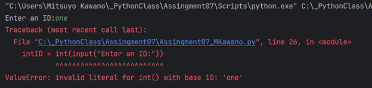  
Figure 3 A Screenshot of error message (PyCharm)    
  
I added try and except as below into my script. If the user inputs numeric ID number, the entire script will be executed, otherwise print the error message to the user.  
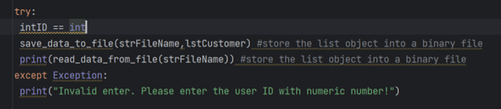  
Figure 4 A Screenshot of try except script (PyCharm)  

Here is the test result. It’s not working well.   
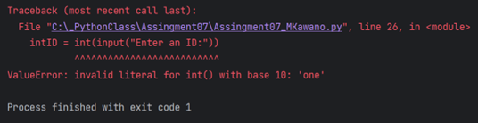  
Figure 5 A Screenshot of error message (PyCharm)  

I realized I have to put all the script I want to try to run inside of the try block. And changed the script as below.  
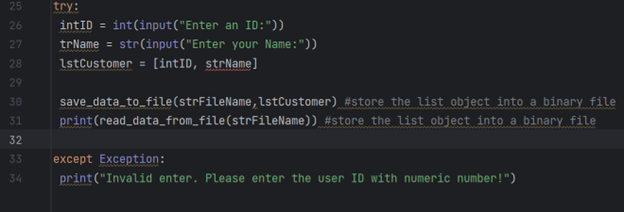  
Figure 6 A Screenshot of modified try and except script (PyCharm)  

It ran successfully! Showing the user-friendly error message.!
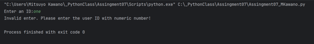  
Figure7 A Screenshot of test result (PyCharm)  
  
    
It ran successfully in Command Line!  

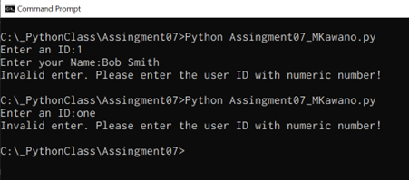  
Figure 8 A Screenshot of the test result (Command)  
  
   

### 3. Think of another possible error and modify the script (Name)  
Another possible error I can think of is the user input the name incorrectly such us only one character. So, I have to add a script to check if the input name data is more than 2 characters.  
First modification is like below.  

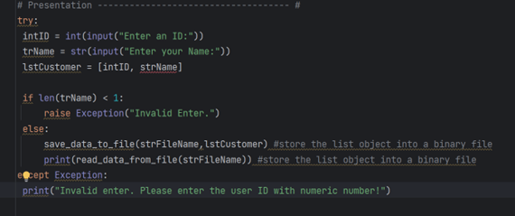  
Figure 9 A Screenshot of modified sript (PyCharm)  
  
  

But the error message is not the one I wanted to show to the user.  
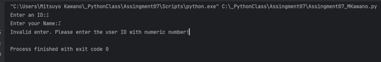  
Figure 10 A Screenshot of the error message (PyCharm)  
  
  
I revised it like this.  

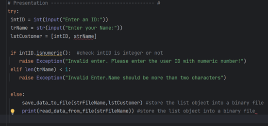  
Figure 11 A Screenshot of modified script (PyCharm)  
  
  
Now showing this error. expected 'except' or 'finally' block??? 
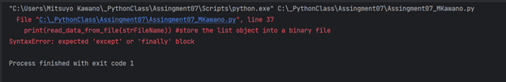  
Figure 12 A Screenshot of the error message (PyCharm)  

                 
I revised it like this.  
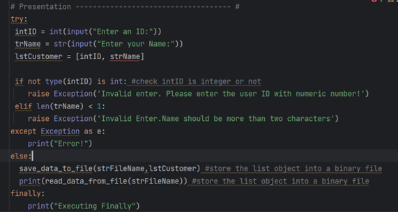  
Figure 13 A Screenshot of the revised script (PyCharm)  
  
  
It runs well but shows error messages all the time.   
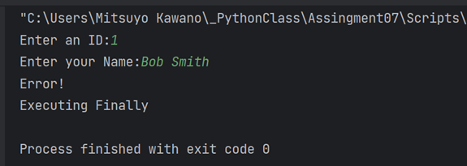  
Figure 14 A Screenshot of the test result (PyCharm)

  I did some research online, and here is the final script I wrote. I commented out the finally statement part since this part is always printed out no matter what, and I felt this is not necessary for this script.
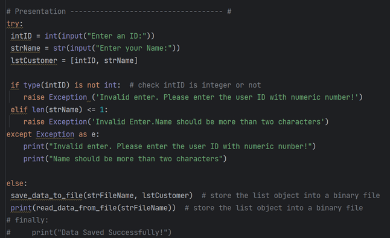  
Figure 15 A Screenshot of the final script (PyCharm)  

Runs successfully.   
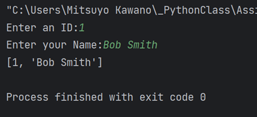  
Figure 16 A Screenshot of the test result (PyCharm)  

Runs successfully with invalid enter. (ID number was entered “one”)  
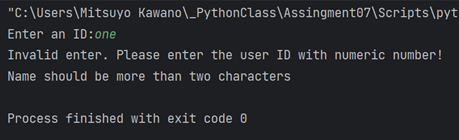  
Figure 17 A Screenshot of the test result (PyCharm)  

Runs successfully with invalid enter. (Name was entered “I” only one character)  
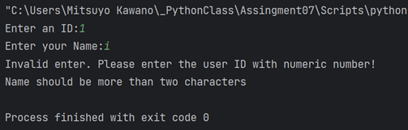  
Figure18 A Screenshot of the test result (PyCharm)

Runs successfully in Command Line.   
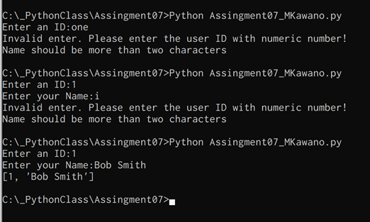  
Figure 19 A Screenshot the running script (Command Line)
  
  

## Summary
 
   Here is the summary of steps to complete this assignment.  
        1. Start with simple script using Lab7-1  
        2. Think about possible errors and modify the script (ID Number)  
        3. Think of another possible error and modify the script (Name)  
     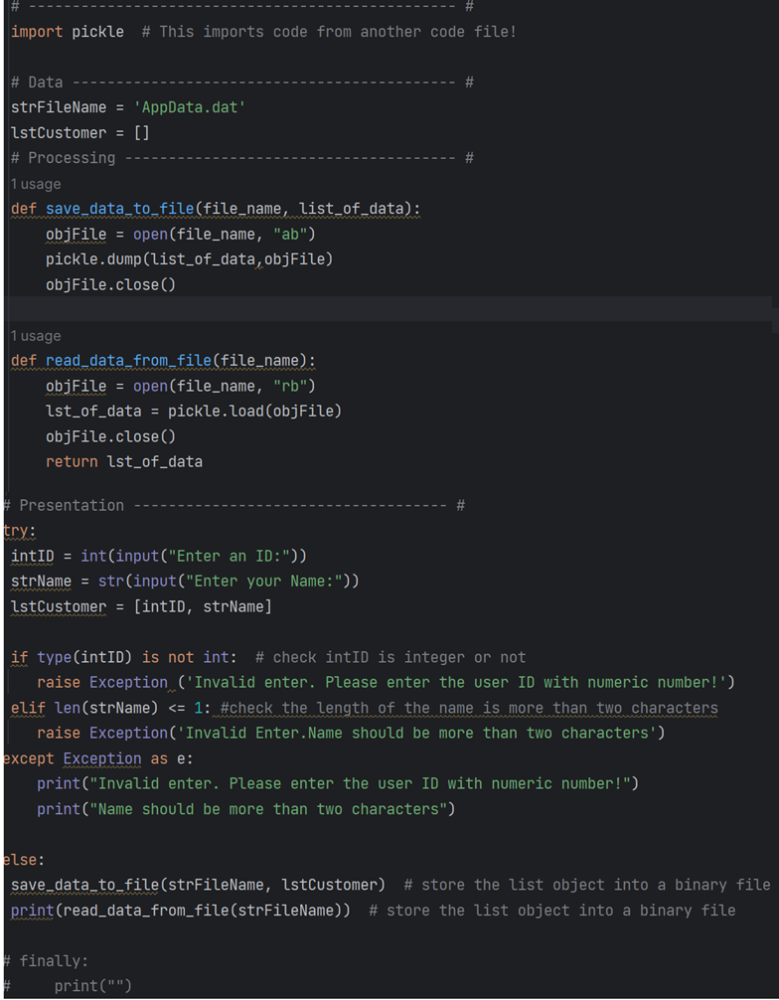  
     Figure 20 A Screenshot of the final script (PyCharm)
     
